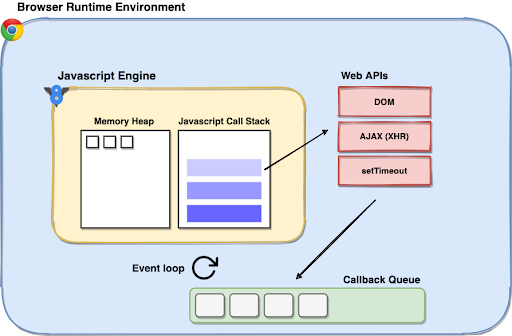

# UNDERSTANDING PROMISES

## SYNCHRONOUS AND ASYNCHRONOUS CODE OPERATIONS IN WEB APPLICATIONS

**Synchronous** code operations happen one at a time, one after another: each line (or block) of code needs to wait for the one before it to complete.

**Asynchronous** code operations on the other hand are non-blocking in nature. They ensure that you don’t need to wait for the lengthier operations to complete before your code can move ahead to the remaining statements.


As you can see from the image, asynchronous code allows us to get much more stuff done in a short amount of time and therefore can be very helpful in web applications.

Writing pure synchronous code that is blocking and halts execution while waiting for a specific task to complete can intermittently freeze your web page, disallowing any user actions. This obviously results in a poor experience for the user.

## EXAMPLE (SYNCHRONOUS JAVASCRIPT CODE)

Let's see a simple javascript code that takes some time to run:

```javascript
const constBigArray = [];
for (let i = 0; i < 10000000; i++) {
  constBigArray[i] = i * i;
}
console.log(constBigArray);
console.log("END OF THE CODE");
```

After running this code, we can see that the message "END OF THE CODE" will be displayed only after some time. That is because the _JavaScript_ language is synchronous and hence blocking in nature. It means any task will run completely before another can run.

## ASYNCHRONOUS PROGRAMMING USING JAVASCRIPT

As we just seen in the previous example, _javascript_ is synchronous by nature. But how it can be used to run asynchronous tasks? This is a very interesting question and we have to understand some concepts before answering it.

Indeed, the **javascript engine** natively has one call stack and one memory heap at its disposal.


However, each time you run Javascript code, there is a broader picture to understand. The _javascript engine_ runs inside a bigger container: the **runtime environment** (with its various APIs). _Javascript_ can run in many environments, but here we are going to focus on the **browser runtime environment** (web development inside the browser). Each browser has its runtime environment. This is where quite a lot of the web development magic happens. Another example of runtime environment is [**Node**](https://nodejs.org/), but it won't be our focus here.



The browser runtime provides you with a bunch of utilitarian tools that are pivotal to web development. It exposes multiple web APIs for developers to effectively utilize the browser environment. For example, the DOM API allows you to manipulate your web page elements, XML HTTP Request (XHR) support for communicating with servers over the internet, and much more. All of this is not a part of the native JS engine, but instead is provided by the browser’s runtime environment.

Among the many advantages of web APIs, they also facilitate concurrency in your application. Let’s see how.

## THE CALL STACK, THE TASK QUEUE AND THE EVENT LOOP

The javascript call stack is a synchronous data structure that keeps track of the function calls in your code. When a function is called, it is pushed to the call stack and when it is done executing, it is popped out.

Now let's see a function with a very specific behavior: the **setTimeout function**. Here is the code that we are going to analyze:

```javascript
console.log("Print this 1st");

setTimeout(() => {
  console.log("Print this 3rd");
}, 3000);

console.log("Print this 2nd");
```

When you call the setTimeout function, after being pushed to the call stack, it is immediately transferred to the browser’s web APIs. These web APIs take up the responsibility of waiting for the operation to complete (in this case, waiting 3000 miliseconds for the timeout period to complete). While these web APIs are tracking the status of the asynchronous operation, the call stack will continue the execution of the rest of the items in the call stack.


Once your setTimeout function is completed, it is pushed to (what is known as) the **tasks queue** (or **callback queue**). This queue stores the asynchronous tasks that have been completed before they are pushed back to the call stack to be finally executed.

The **event loop** is the last part of this equation that is responsible for pushing the items waiting in the tasks queue to the main call stack. It closely monitors the call stack and the task queue. When the call stack is empty, it picks the topmost item from the task queue and pushes it to the call stack for execution. There is also another queue to consider called the microtask queue, but we are going to talk about it later.

## PROMISES

A promise, in our context, is a javascript tool used to run some task that is going to take some time to finish. Just like in real life, there are two possible outcomes of a promise: either the promise is kept (resolved) or some error occurs and the promise promise is broken (rejected).

The constructor syntax for a promise object is:

```javascript
new Promise(functionExecutor);
```

The function passed to new Promise is called the **executor** (`functionExecutor`). When `new Promise` is created, the executor runs automatically. It contains the producing code which should eventually produce the result.

Here is a basic example of a promise:

```javascript
const functionExecutor = function(){
    setTimeout(() => {
        console.log("DONE");
    }, 3000);
};

new Promise(functionExecutor);

console.log("END OF THE CODE");
```

After running this code, we can see that the message "END OF THE CODE" is shown before the message "DONE". This happened because the executor code contained a _setTimeout_ and, as we have seen earlier, this function is going to be executed by the web API of the (browser) runtime environment, without blocking the execution flow.

Now let's see what happens when the executor function contains time consuming code that will be executed by the javascript engine:

```javascript
const functionExecutor = function(){
    const constBigArray = [];
    for (let i = 0; i < 10000000; i++) {
        constBigArray[i] = i * i;
    }
    console.log(constBigArray);
    console.log("THE ARRAY IS READY");
};

new Promise(functionExecutor);

console.log("END OF THE CODE");
```

Run the code and now you will see that "THE ARRAY IS READ" is shown before "END OF THE CODE". That happened because the _executor function_ code was executed by the javascript engine, that is syncrhonous by nature (blocking).

## RESOLVE, REJECT AND PROMISE STATES

The _executor_ function may have two arguments that are going to be named here as **resolve** and **reject**. These arguments are functions pre-defined by the JavaScript engine, so we don’t need to create them. The _executor_ should call:

* `resolve(value)`: if the promised task is finished successfully (`value` is the promise result).
* `reject(error)`: if an error has occurred (`error` is an error object).

So to summarize: the executor runs automatically and attempts to perform a task. When it is finished with the attempt, it calls resolve if it was successful or reject if there was an error.

As a proxy for future results, the promisse can be put in a promise object that tracks its state and result:

```javascript
const constPromiseObject = new Promise(functionExecutor);
```

The promise object (`constPromiseObject`) returned by the `new Promise` constructor has these two internal properties:

* state: initially "pending", then changes to either "fulfilled" when resolve is called or "rejected" when reject is called.
* result: initially undefined, then changes to value when resolve(value) called or error when reject(error) is called.


Here is an example:

```javascript
const functionExecutor = function(resolve, reject){
    setTimeout(() => {
        console.log("THIS WILL BE SHOWN AFTER THE END");
        resolve("done");
    }, 3000);
};

const constPromiseObject = new Promise(functionExecutor);

console.log(constPromiseObject);

console.log("END OF THE CODE");

// WAIT 3 SECONDS AND THEN RUN:

console.log(constPromiseObject);
```

After 3 seconds of “waiting”, the executor calls `resolve("done")` to produce the result. This changes the state of the promise object:


That was an example of a successful job completion, a “fulfilled promise”.

And now an example of the executor rejecting the promise with an error:

```javascript
const functionExecutor = function(resolve, reject){
    setTimeout(() => {
        console.log("THIS WILL BE SHOWN AFTER THE END");
        reject("error");
    }, 3000);
};

const constPromiseObject = new Promise(functionExecutor);

console.log(constPromiseObject);

console.log("END OF THE CODE");

// WAIT 3 SECONDS AND THEN RUN:

console.log(constPromiseObject);
```

After 3 seconds the call to `reject` moves the promise object to "rejected" state:


```javascript
const constPromiseObject = new Promise(functionExecutor).then(functionHandleSuccessfulResult, functionHandleError);
```


<!-- ## EXAMPLE (CODE THAT TAKES SOME TIME TO RUN PLACED INSIDE A FUNCTION)

Now, lets see how we can run this code several times, putting it inside a function:

```html
<script>
    const functionBigArray = function () {
        const constBigArray = [];
        for (let i = 0; i < 10000000; i++) {
            constBigArray[i] = i * i;
        }
        return constBigArray;
    };
    console.log(functionBigArray());
    console.log(functionBigArray());
    console.log("END OF THE CODE");
</script>

Once again, we can notice the blocking nature of javascript. -->

<!-- ## EXAMPLE (BASIC PROMISE AND THE MICROTASK QUEUE)

```html
<script>
    const functionPromisedTasks = function (resolve) {
        console.log("I AM A PROMISED TASK.");
        resolve(); // SEND functionMicrotask TO THE MICROTASK QUEUE.
    };

    const functionMicrotask = function () {
        console.log("I PASSED THROUGH THE MICROTASK QUEUE.");
    };

    new Promise(functionPromisedTasks).then(functionMicrotask);
    console.log("END OF THE CODE");
</script>
``` -->

<!-- <script>
	// BASIC PROMISE RESULT
	const constPromiseResult = new Promise(function (resolve) {
		console.log("I AM INSIDE THE PROMISE.");
		resolve();
	}).then(function () {
		console.log("I PASSED THROUGH THE MICROTASK QUEUE.");
	});
	console.log(constPromiseResult);
	console.log("END OF THE CODE");
	/////
</script>
<button onclick="console.log(constPromiseResult);">CHECK PROMISE STATUS</button> -->

<!-- <script>
	// WITH A PROMISE CONTAINING JAVASCRIPT
	const constMyPromise = new Promise(function (resolve) {
		const constBigArray = [];
		for (let i = 0; i < 10000000; i++) {
			constBigArray[i] = i * i;
		}
		resolve();
		console.log("I AM AT THE END OF THE PROMISE.");
	}).then(function() {
		console.log("I PASSED THROUGH THE MICROTASK QUEUE.");
		return "I AM THE PROMISE RETURN";
	});
	console.log("END OF THE CODE");
	/////
</script>
<button onclick="console.log(constMyPromise);">CHECK PROMISE STATUS</button> -->

<!-- <script>
	new Promise(function (resolve) {
		setTimeout(() => {
			resolve("RESOLVE RESULT");
		}, 5000);
	}).then(function (argWhatWasResolved) {
		console.log(argWhatWasResolved);
		return "PROMISE RESULT";
	});
	console.log("END OF THE CODE");
</script> -->

<!-- <script>
	// FUNCTION THAT RETURNS A PROMISE
	const functionFunctionThatReturnsAPromise = function () {
		const constPromise = new Promise(function (resolve) {
			const constBigArray = [];
			for (let i = 0; i < 10000000; i++) {
				constBigArray[i] = i * i;
			}
			resolve(constBigArray);
		}).then(function (argWhatWasResolved) {
			return argWhatWasResolved;
		});
		return constPromise;
	};
	const constMyFirstPromise = functionFunctionThatReturnsAPromise();
	const constMySecondPromise = functionFunctionThatReturnsAPromise();
	console.log(constMyFirstPromise);
	console.log(constMySecondPromise);
	console.log("END OF THE CODE");
	/////
</script>
<button onclick="console.log(constMyFirstPromise);">CHECK FIRST PROMISE STATUS</button>
<button onclick="console.log(constMySecondPromise);">CHECK SECOND PROMISE STATUS</button> -->

<script>
	// const functionAsynchronousFunction = async function () {
	// 	const constMyPromise = new Promise(function (resolve) {
	// 		const constBigArray = [];
	// 		for (let i = 0; i < 10000000; i++) {
	// 			constBigArray[i] = i * i;
	// 		}
	// 		resolve(constBigArray);
	// 	});
	// 	const bb = await constMyPromise;
	// 	return `THE THIRD ELEMENT OF THE ARRAY IS ${bb[3]}`;
	// };
	// const constMyPromise = aa();

	// // WITH ASYNCHRONOUS FUNCTION
	// const functionAsyncFunction = async function () {
	// 	const constBigArray = [];
	// 	for (let i = 0; i < 100000000; i++) {
	// 		constBigArray[i] = i ^ 2;
	// 	}
	// 	return constBigArray;
	// };
	// const constMyPromise = functionAsyncFunction();
	// console.log(constMyPromise);
	// console.log("END OF THE CODE");
	// /////

	//const bb = fetch("https://cdn.jsdelivr.net/gh/akabab/superhero-api@0.3.0/api/id/1.json");
</script>

<!-- <button onclick="console.log(constMyPromise);">CHECK PROMISE STATUS</button> -->
