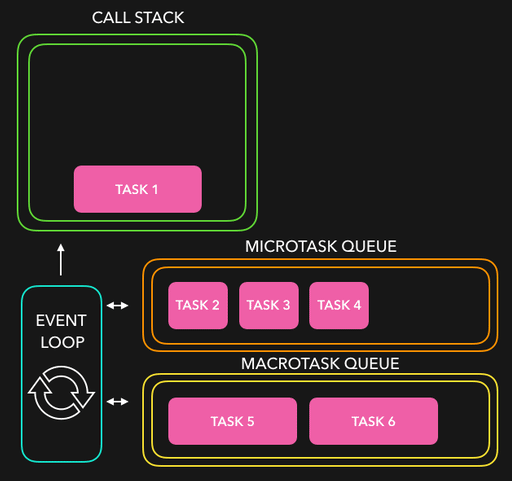

# MICROTASKS

## THE BEHAVIOR

Promise handlers .then/.catch/.finally are always asynchronous.

Even when a Promise is immediately resolved, the code bellow it will still run before its handlers.

Here’s a demo:

```javascript
const functionExecutor = function(resolve){
   resolve();
};

const functionHandleResult = function(){
    console.log("PROMISE DONE."); // THIS MESSAGE SHOWS SECOND 
};

const constPromiseObject = new Promise(functionExecutor).then(functionHandleResult);

console.log("END OF THE CODE."); // THIS MESSAGE SHOWS FIRST
```

If you run it, you see "END OF THE CODE." first, and then "PROMISE DONE.". That’s strange, because the promise is definitely done from the beginning. Why did the .then trigger afterwards? What’s going on?

## MICROTASKS QUEUE

Asynchronous tasks need proper management. For that, Javascript uses an internal queue referred to as the **microtask queue**. Here is how it works... When a promise is ready, its handlers are put into the microtask queue (they are not executed yet). When the JavaScript engine becomes free from the current code, it takes a task from the queue and executes it.

That’s why "END OF THE CODE." in the example above shows first.

If there’s a chain with multiple `.then`, then every one of them is executed asynchronously. That is, it first gets queued, then executed when the current code is complete and previously queued handlers are finished.

In most Javascript engines, including browsers and Node.js, the concept of microtasks is closely tied with the “event loop” and “macrotasks”. These concepts will be covered next.

## MACROTASKS VERSUS MICROTASKS

As we have seen, an execution of promisse handlers goes to the microtask queue to run later when the javascript engine becomes free. On the other hand, we also saw that the setTimeout function sends its callback function to the macrotask queue. So, there are two queues competing for what will be chosen first by the event loop and, consequently, executed first.



The order of execution rule is:

* All functions that are currently in the call stack get executed. When they returned a value, they get popped off the stack.
* When the call stack is empty, all queued up microtasks are popped onto the call stack one by one, and get executed (microstask also execute at the end of each macrotask).
* If both the call stack and microtask queue are empty, the event loop checks if there are tasks left on the macrotask queue. The tasks get popped onto the call stack, executed, and popped off!

For instance, take a look on the following example, where setTimeout instruction is to execute its callback immediately (after zero miliseconds) and the promise is also resolved immediately. Let's take a look on what is going to run first:

```javascript
const functionCallback = function(){
   console.log("TIMEOUT FINISHED."); // THIS MESSAGE SHOWS LAST.
};
setTimeout(functionCallback, 0);

const functionExecutor = function(resolve){
    resolve();
};
const functionHandleResult = function(){
    console.log("PROMISE FINISHED."); // THIS MESSAGE SHOWS SECOND. 
};
new Promise(functionExecutor).then(functionHandleResult);

console.log("END OF THE CODE.") // THIS MESSAGE SHOWS FIRST
```

What is happening here is:

* "END OF THE CODE." shows first, because it’s a regular synchronous call.
* "PROMISE FINISHED." shows second, because `functionHandleResult` passes through the microtask queue.
* "TIMEOUT FINISHED." shows last, because `functionCallback` passes through the macrotask queue.
