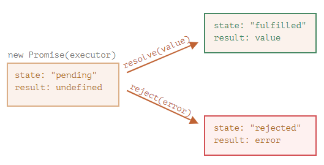
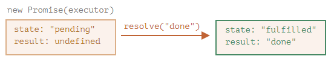
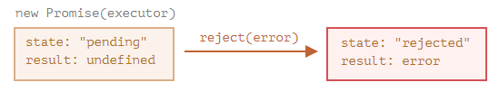
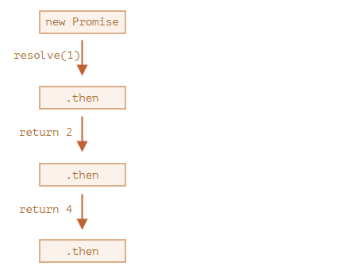

# PROMISES

## INTRODUCTION

A promise, in our context, is a javascript tool used to run some task that is going to take some time to finish. Just like in real life, there are two possible outcomes of a promise: either the promise is kept (resolved) or some error occurs and the promise promise is broken (rejected).

The constructor syntax for a promise object is:

```javascript
new Promise(functionExecutor);
```

The function passed to new Promise is called the **executor** (`functionExecutor`). When `new Promise` is created, the executor runs automatically. It contains the producing code which should eventually produce the result.

Here is a basic example of a promise:

```javascript
const functionExecutor = function(){
    setTimeout(() => {
        console.log("DONE"); // THIS MESSAGE IS SHOWN LAST.
    }, 3000);
};

new Promise(functionExecutor);

console.log("END OF THE CODE"); // THIS MESSAGE IS SHOWN FIRST.
```

After running this code, we can see that the message "END OF THE CODE" is shown before the message "DONE". This happened because the executor code contained a _setTimeout_ and, as we have seen earlier, this function is going to be executed by the web API of the (browser) runtime environment, without blocking the execution flow.

Now let's see what happens when the executor function contains time consuming code that will be executed by the javascript engine:

```javascript
const functionExecutor = function(){
    const arraySquares = [];
    for (let i = 0; i < 10000000; i++) {
        arraySquares[i] = i * i;
    }
    console.log(arraySquares);
    console.log("THE ARRAY IS READY"); // THIS MESSAGE IS SHOWN FIRST.
};

new Promise(functionExecutor);

console.log("END OF THE CODE"); // THIS MESSAGE IS SHOWN LAST.
```

Run the code and now you will see that "THE ARRAY IS READ" is shown before "END OF THE CODE". That happened because the _executor function_ code was executed by the javascript engine, that is syncrhonous by nature (blocking).

In short, I would say that promises make sense when they contain code that will be executed by the web API.

## RESOLVE, REJECT AND PROMISE STATES

The _executor_ function may have two arguments that are going to be named here as **resolve** and **reject**. These arguments are functions pre-defined by the JavaScript engine, so we don’t need to create them. The _executor_ should call:

* `resolve(value)`: if the promised task is finished successfully (`value` is the promise result).
* `reject(error)`: if an error has occurred (`error` is the promise error).

So to summarize: the executor runs automatically and attempts to perform a task. When it is finished with the attempt, it calls resolve if it was successful or reject if there was an error.

As a proxy for future results, the promisse can be put in a promise object that tracks its state and result:

```javascript
const promiseObject = new Promise(functionExecutor);
```

The promise object (`promiseObject`) returned by the `new Promise` constructor has these two internal properties:

* state: initially "pending", then changes to either "fulfilled" when resolve is called or "rejected" when reject is called.
* result: initially undefined, then changes to value when resolve(value) called or error when reject(error) is called.



Here is an example:

```javascript
const functionExecutor = function(resolve, reject){
    setTimeout(() => {
        console.log("THIS WILL BE SHOWN AFTER THE END");
        resolve("done");
    }, 3000);
};

const promiseObject = new Promise(functionExecutor);

console.log(promiseObject);

console.log("END OF THE CODE");

// WAIT 3 SECONDS AND THEN RUN:

console.log(promiseObject);
```

After 3 seconds of “waiting”, the executor calls `resolve("done")` to produce the result. This changes the state of the promise object:



That was an example of a successful task completion, a “fulfilled promise”.

And now an example of the executor rejecting the promise with an error:

```javascript
const functionExecutor = function(resolve, reject){
    setTimeout(() => {
        console.log("THIS WILL BE SHOWN AFTER THE END");
        reject("error");
    }, 3000);
};

const promiseObject = new Promise(functionExecutor);

console.log(promiseObject);

console.log("END OF THE CODE");

// WAIT 3 SECONDS AND THEN RUN:

console.log(promiseObject);
```

After 3 seconds the call to `reject` moves the promise object to "rejected" state:



The properties state and result of the Promise object are internal. We can’t directly access them. We can use the method `.then` for that and that is what we will see below.

## THEN

To access the value passed by the resolve or reject functions, we can use `.then()`.

```javascript
const promiseObject = new Promise(functionExecutor).then(functionHandleResolve, functionHandleReject);
```

It takes two optional arguments: a callback handler for a resolved case (`functionHandleResolve`) and another for a rejected one (`functionHandleReject`). These functions have one argument:

* The promise result, provided by the _resolve function_ is passed to `functionHandleResolve` through its argument.
* The promise error, provided by the _reject function_ is passed to `functionHandleReject` through its argument.

Here is an example:

```javascript
const functionExecutor = function(resolve, reject){
    setTimeout(() => {
        console.log("THIS WILL BE SHOWN AFTER THE END");
        resolve("done"); // reject("error");
    }, 3000);
};

const functionHandleResolve = function(argResult){
    console.log(`I AM THE CALLBACK OF THE RESOLVED CASE AND THE PROMISE RESULT IS '${argResult}'`);
    return "NEW PROMISE RESULT";
};

const functionHandleReject = function(argResult){
    console.log(`I AM THE CALLBACK OF THE REJECTED CASE AND THE PROMISE ERROR IS '${argResult}'`);
    return "NEW PROMISE ERROR";
};

const promiseObject = new Promise(functionExecutor).then(functionHandleResolve, functionHandleReject);

console.log(promiseObject);

console.log("END OF THE CODE");

// WAIT 3 SECONDS AND THEN RUN:

console.log(promiseObject);
```

As we can see by runnnig the code, `.then()` returns a new promise and hence a promise chaining is possible. So, let's talk about promise chaining...

## PROMISE CHAINING

Promises provide a way to perform asynchronous tasks one after another. It looks like this:

```javascript
const functionExecutor = function(resolve, reject) {
    setTimeout(() => resolve(1), 1000); // (*)
};
const functionFirstHandler = function(argResult) { // (**)
    alert(argResult); // 1
    return argResult * 2;
};
const functionSecondHandler = function(argResult) { // (***)
    alert(argResult); // 2
    return argResult * 2;
};
const functionThirdHandler = function(argResult) {
  alert(argResult); // 4
  return argResult * 2;
};

new Promise(functionExecutor).then(functionFirstHandler).then(functionSecondHandler).then(functionThirdHandler);
```

The idea is that the result is passed through the chain of .then handlers. Here the flow is:

* The initial promise resolves in 1 second (*),
* Then `functionFirstHandler` is called (**), which in turn creates a new promise (resolved with 2 value).
* The next then (***) gets the result of the previous one, processes it (doubles) and passes it to the next handler.
* …and so on.

As the result is passed along the chain of handlers, we can see a sequence of alert calls: 1 → 2 → 4.



The whole thing works, because every call to `.then` returns a new promise, so that we can call the next .then on it.

## RETURNING PROMISES

A handler, used in `.then(handler)` may create and return a promise. In that case further handlers wait until it settles, and then get its result. For instance:

```javascript

const functionExecutor = function(resolve, reject) {
    setTimeout(() => resolve(1), 1000);
};
const functionFirstHandler = function(argResult) {
    alert(argResult); // 1
    return new Promise((resolve, reject) => { // (*)
      setTimeout(() => resolve(argResult * 2), 1000);
    });
};
const functionSecondHandler = function(argResult) { // (**)
    alert(argResult); // 2
    return new Promise((resolve, reject) => {
      setTimeout(() => resolve(argResult * 2), 1000);
    });
};
const functionThirdHandler = function(argResult) {
    alert(argResult); // 4
};

new Promise(functionExecutor).then(functionFirstHandler).then(functionSecondHandler).then(functionThirdHandler);
```

The output is the same as in the previous example: 1 → 2 → 4, but now with 1 second delay between alert calls. This way, returning promises allows us to build chains of asynchronous actions.

[BACK](../README.md)
