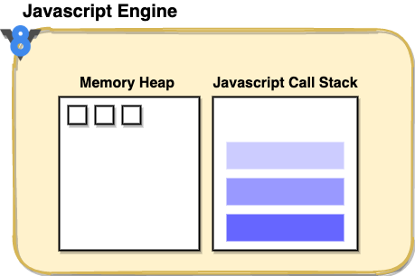
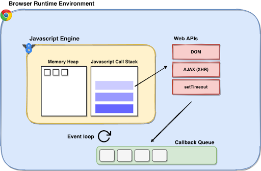

# SYNCHRONOUS AND ASYNCHRONOUS CODE OPERATIONS IN WEB APPLICATIONS

## SYNCHRONOUS AND ASYNCHRONOUS CODE OPERATIONS

**Synchronous** code operations happen one at a time, one after another: each line (or block) of code needs to wait for the one before it to complete.

**Asynchronous** code operations on the other hand are non-blocking in nature. They ensure that you don’t need to wait for the lengthier operations to complete before your code can move ahead to the remaining statements.


As you can see from the image, asynchronous code allows us to get much more stuff done in a short amount of time and therefore can be very helpful in web applications.

Writing pure synchronous code that is blocking and halts execution while waiting for a specific task to complete can intermittently freeze your web page, disallowing any user actions. This obviously results in a poor experience for the user.

## EXAMPLE (SYNCHRONOUS JAVASCRIPT CODE)

Let's see a simple javascript code that takes some time to run:

```javascript
const arraySquares = [];
for (let i = 0; i < 10000000; i++) {
  arraySquares[i] = i * i;
}
console.log(arraySquares);
console.log("END OF THE CODE");
```

After running this code, we can see that the message "END OF THE CODE" will be displayed only after some time. That is because the _JavaScript_ language is synchronous and hence blocking in nature. It means any task will run completely before another can run.

## ASYNCHRONOUS PROGRAMMING USING JAVASCRIPT

As we just seen in the previous example, _javascript_ is synchronous by nature. But how it can be used to run asynchronous tasks? This is a very interesting question and we have to understand some concepts before answering it.

Indeed, the **javascript engine** natively has one call stack and one memory heap at its disposal.



However, each time you run Javascript code, there is a broader picture to understand. The _javascript engine_ runs inside a bigger container: the **runtime environment** (with its various APIs). _Javascript_ can run in many environments, but here we are going to focus on the **browser runtime environment** (web development inside the browser). Each browser has its runtime environment. This is where quite a lot of the web development magic happens. Another example of runtime environment is [**Node**](https://nodejs.org/), but it won't be our focus here.



The browser runtime provides you with a bunch of utilitarian tools that are pivotal to web development. It exposes multiple web APIs for developers to effectively utilize the browser environment. For example, the DOM API allows you to manipulate your web page elements, XML HTTP Request (XHR) support for communicating with servers over the internet, and much more. All of this is not a part of the native JS engine, but instead is provided by the browser’s runtime environment.

Among the many advantages of web APIs, they also facilitate concurrency in your application. Let’s see how.

## THE CALL STACK, THE TASK QUEUE AND THE EVENT LOOP

The javascript call stack is a synchronous data structure that keeps track of the function calls in your code. When a function is called, it is pushed to the call stack and when it is done executing, it is popped out.

Now let's see a function with a very specific behavior: the **setTimeout function**. Here is the code that we are going to analyze:

```javascript
console.log("Print this 1st");

setTimeout(() => {
  console.log("Print this 3rd");
}, 3000);

console.log("Print this 2nd");
```

When you call the setTimeout function, after being pushed to the call stack, it is immediately transferred to the browser’s web APIs. These web APIs take up the responsibility of waiting for the operation to complete (in this case, waiting 3000 miliseconds for the timeout period to complete). While these web APIs are tracking the status of the asynchronous operation, the call stack will continue the execution of the rest of the items in the call stack.


Once your setTimeout function is completed, it is pushed to (what is known as) the **tasks queue** (or **callback queue** or **macrotask queue**). This queue stores the asynchronous tasks that have been completed before they are pushed back to the call stack to be finally executed.

The **event loop** is the last part of this equation that is responsible for pushing the items waiting in the tasks queue to the main call stack. It closely monitors the call stack and the task queue. When the call stack is empty, it picks the topmost item from the task queue and pushes it to the call stack for execution. There is also another queue to consider called the microtask queue, but we are going to talk about it later.

[BACK](../README.md)
